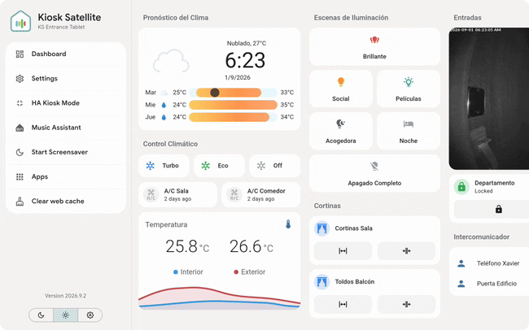
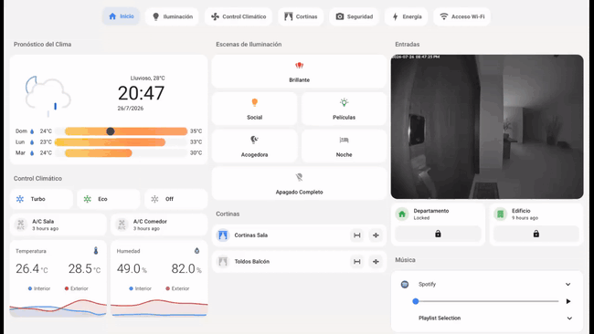
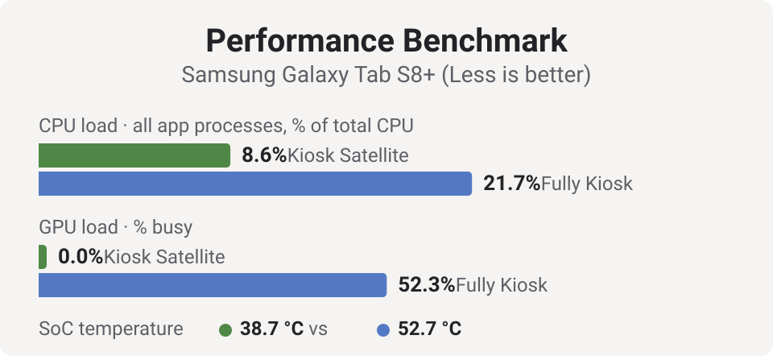
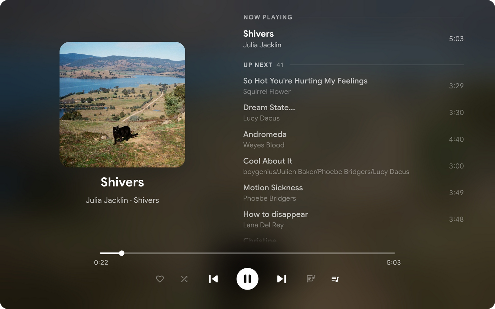
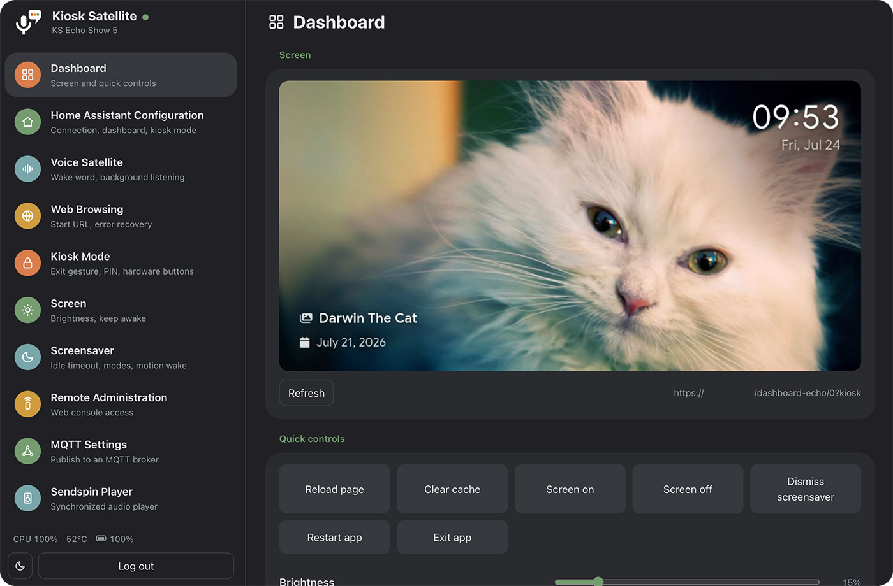
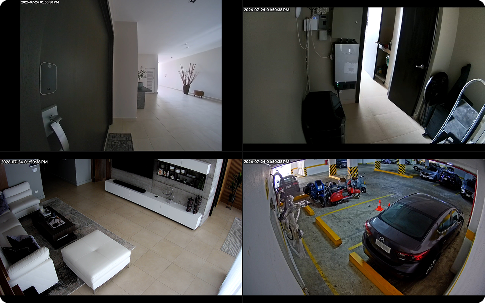
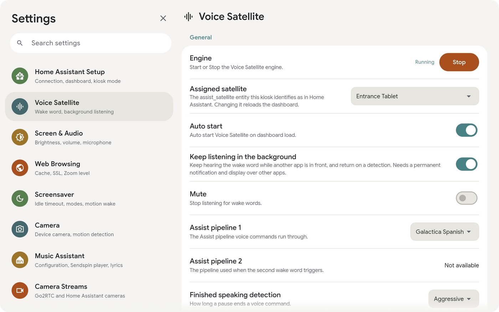

<h1 align="center" style="border-bottom: none">
   <picture>
      <source media="(prefers-color-scheme: dark)" srcset="assets/banners/ks_banner_dark.svg" />
      <source media="(prefers-color-scheme: light)" srcset="assets/banners/ks_banner_light.svg" />
      
   </picture>
</h1>

Transform any Android device into a beautiful, dedicated Home Assistant kiosk. Built specifically for Home Assistant from the ground up, Kiosk Satellite gives you a smooth, native dashboard experience. Want voice control? Pair it with [Voice Satellite](https://github.com/jxlarrea/voice-satellite-card-integration) for a fully hands-free setup. Kiosk Satellite is completely free and open source.

 

## Main Features

&bull; **Guided setup**: Get up and running easily. A five-step wizard connects to your Home Assistant instance, lets you pick a dashboard, detects Voice Satellite automatically, and only asks for the Android permissions it actually needs. You can run the setup directly on the device or from a browser on your computer.

&bull; **Native [Voice Satellite](https://github.com/jxlarrea/voice-satellite-card-integration)**: Your kiosk gets its own `assist_satellite` entity, and the app's built-in engine takes over wake-word detection. It quietly listens in the background even with the screen off using a fraction of the CPU a web browser requires. There's no extra configuration needed; it inherits everything directly.

 

&bull; **Fully unlocked plain HTTP**: No certificates or reverse proxies required. A loopback proxy inside the app turns an `http://` dashboard into a genuine secure context automatically, meaning your microphone and other HTTPS-only features work right out of the box.

&bull; **Smooth performance on older devices**: Optional [optimizations](docs/optimizations.md) filter Home Assistant's state stream to only update the entities currently visible on your screen, turning constant stutter into smooth scrolling. It also pauses rendering when the screensaver is on, dropping CPU/GPU usage dramatically. Voice and connection keep running, and anything it can't filter safely is left alone, so nothing breaks.

 

&bull; **Kiosk lockdown**: Keep your setup secure. Features include an exit PIN, blocked hardware buttons (back/volume/home), a status-bar shield, instant re-wake on the power button, and lock-task support for fully provisioned devices.

&bull; **Custom gestures**: Keep your interface clean by mapping invisible gestures to [configurable actions](docs/gestures.md). Use corner taps, multi-finger holds, knock-codes, claps (heard through the mic, no Voice Satellite required), or even hand signals to the camera. Use them to jump to views, run HA scripts, or open other apps without guests ever knowing.

&bull; **Synchronized media player**: Use your device as a perfectly synced [Sendspin](https://www.sendspin-audio.com/) speaker for Music Assistant. Alternatively, let the kiosk follow another player (like any HA media player or Sonos speaker) to display album artwork, lyrics, and volume controls on screen.

 

&bull; **Dynamic screensavers**: Choose from dim, black, clock, local photos, or a stunning [Immich](docs/immich.md) photo frame with transition effects (slide, zoom, Ken Burns) and metadata overlays. Includes support for waking up via motion, face, or presence detection.

&bull; **Remote administration**: Manage everything from your computer. The embedded web admin (`http://<device-ip>:2324`) mirrors your settings, shows a live screenshot, provides a web console for logs, and handles configuration backups. With several kiosks on the network, a kiosk switcher under the logo jumps between their admin pages in one tab.

&bull; **Fleet Management**: A primary kiosk acts as the fleet leader to manage and synchronize multiple follower devices. The leader assigns each follower a profile (a designated collection of configuration settings, credentials, and specific exclusions), pushes permitted settings and can coordinate fleet-wide updates to a single app release. See [Fleet Management](docs/fleet.md).

&bull; **Dashboard view rotation**: Set your kiosk to automatically cycle through specific dashboard views on an endless loop, customizing how many seconds each view stays on screen.

&bull; **DLNA renderer**: Push videos, images, and live cameras directly to the full screen using `media_player.play_media`, perfect for HA automations.

 

&bull; **Native ESPHome integration**: Home Assistant discovers the kiosk automatically. No broker, no YAML. You get a massive catalog of entities right out of the box: screen light, volume sliders, screensaver switches, a live camera stream, and full diagnostics.

&bull; **Built-in Bluetooth proxy**: Acting just like an ESP32, the ESPHome connection relays BLE advertisements and active connections for your BTHome sensors, locks, and buttons. Multiple kiosks can even form a Bluetooth mesh network.

&bull; **Everyday kiosk conveniences**: Pull-to-refresh, boot on start, keep-screen-awake, adaptive brightness using the device's light sensor, scheduled themes, custom JavaScript injection, and self-signed certificate support.
  
&bull; **Advanced camera streams**: Import streams via Go2RTC or manually add WebRTC, MSE, HLS, or MJPEG cameras. You can arrange up to four feeds into responsive [camera views](docs/cameras.md) accessible from the device, Remote Admin, or Home Assistant.

 

## Kiosk Satellite + Voice Satellite

[Voice Satellite](https://github.com/jxlarrea/voice-satellite-card-integration) turns a Home Assistant dashboard into a full hands-free voice assistant with a wake word, timers, and announcements. However, because it relies on the browser, it hits a wall on dedicated devices: browsers can't listen while the screen is off, their wake-word engines are resource-heavy, and standard HTTP setups block microphone access entirely.

Kiosk Satellite shatters those limits. The app runs Voice Satellite's wake-word models natively and transparently. Voice Satellite realizes it’s inside Kiosk Satellite and smoothly hands over the detection work. You still configure everything as usual in Voice Satellite; the kiosk just makes it always-on, highly efficient, and independent of the screen state.

 

This massive performance boost is one of the best reasons to use Kiosk Satellite. By running native inference on the CPU, the wake-word pipeline operates incredibly fast, saving your device's battery and CPU while keeping the dashboard buttery smooth. It’s so efficient that vsWakeWord can comfortably run on something as low-powered as an Amazon Echo Show 5.

Plus, you aren't forced to keep the dashboard open. With background listening enabled, the wake word continues working even if the screen is off or **you have another app open**. Just say the word, and the kiosk instantly brings the dashboard front and center to answer.

| Capability | Voice Satellite alone | Kiosk Satellite + Voice Satellite |
| --- | --- | --- |
| Wake word with the dashboard on screen | ✅ | ✅ |
| Wake word with the screen off | ❌ | ✅ |
| Wake word with another app in front | ❌ | ✅ Returns to the dashboard on trigger |
| Mic access in non-HTTPS HA instances | ❌ | ✅ |
| Detection cost | ⚠️ Browser based, heavy on the device | ✅ Native CPU inference, 10x-30x faster |
| Wake word on low-end hardware | ⚠️ Struggles | ✅ CPU only, no GPU needed |
| Survives reboots | ⚠️ Manual relaunch | ✅ Start on boot |

While you don't *have* to use Voice Satellite (Kiosk Satellite is a fantastic HA dashboard all on its own), putting them together essentially gives you a custom-built smart display and voice hub.

## Installation

Kiosk Satellite is completely free and distributed as an APK for sideloading:

1. Download the latest APK from the [releases page](../../releases).
2. Copy it to your Android device (or download it directly there) and open it. If Android prompts you, allow installation from unknown sources.
3. Open the app and follow the simple setup wizard. 
   
> **Pro Tip:** In the first step (naming the device), enable Remote Administration. You can then finish the rest of the setup from your computer's browser.

**Requirements:** Android 7.0 or newer, a reachable Home Assistant instance, and a long-lived access token (found in HA Profile → Security → Long-lived access tokens). For voice features, make sure to install [Voice Satellite](https://github.com/jxlarrea/voice-satellite-card-integration) from the default HACS repository.

## Documentation

- [JavaScript API](docs/js-api.md): Info on `window.kioskSatellite` and the wake-word handoff protocol.
- [Remote API](docs/remote-api.md): Details on the REST + WebSocket interface.
- [ESPHome](docs/esphome.md): Everything you need to know about native HA entities and Bluetooth proxying via the ESPHome API.
- [Camera streams](docs/cameras.md): Using Go2RTC import, setting up camera views, and HA controls.
- [Screen](docs/screen.md): Keep-awake settings, default brightness, and adaptive brightness logic.
- [Screensavers](docs/screensavers.md): Modes, schedules, brightness, motion waking, and triggers.
- [Device camera](docs/camera.md): Utilizing the tablet's physical camera for still images and motion detection in HA.
- [Media Player](docs/sendspin.md): The floating player, Now Playing views, Sendspin integration, and following HA/Sonos players.
- [DLNA](docs/dlna.md): Pushing media to the kiosk from HA or DLNA apps.
- [Immich](docs/immich.md): Setting up the Immich photo-frame screensaver, metadata overlays, and local caching.
- [At a Glance](docs/at-a-glance.md): Adding a row of entity states directly onto your screensaver.
- [Kiosk and Lockdown](docs/kiosk.md): Understanding Kiosk Mode protections, permissions, and device owner provisioning.
- [Home Launcher](docs/home-launcher.md): Setting Kiosk Satellite as the device's home screen.
- [Gestures](docs/gestures.md): Mapping touch and camera gestures to custom actions.
- [Microphone](docs/microphone.md): Capture modes and AGC for devices with quiet microphones.
- [Optimizations](docs/optimizations.md): Performance switches and connection tweaks for older hardware.
- [Permissions](docs/permissions.md): A detailed breakdown of every Android permission the app requests, `adb` grant commands, and background service details.
- [Updates](docs/updates.md): How updates work, required permissions, and enabling hands-free updates.
- [Fleet Management](docs/fleet.md): Leading a fleet of kiosks, profiles, what syncs and what never does, and updating the whole fleet.

### Device Specific Guides
- [Meta Portal](docs/portal.md): Running Kiosk Satellite on a Meta Portal and fixing Person detector permissions.
- [Amazon Fire tablets](docs/fire.md): Navigating Fire OS quirks, clearing lock screens, and useful `adb` tweaks.

## License

Kiosk Satellite is free for personal, non-commercial use, licensed under [CC BY-NC-ND 4.0](https://creativecommons.org/licenses/by-nc-nd/4.0/). You are welcome to use and share it, but commercial use and derivative works are not permitted. See [LICENSE](LICENSE) for full details.

## Acknowledgements

Kiosk Satellite stands on the shoulders of several amazing open-source projects. A massive thank you to:

- [Home Assistant](https://www.home-assistant.io/) and [ESPHome](https://esphome.io/), the incredible ecosystem this app was built for.
- [Music Assistant](https://www.music-assistant.io/) for powering the media player experience.
- [Immich](https://immich.app/) for providing the backend to everyone's favorite photo-frame screensaver.
- [Flutter](https://flutter.dev/) and [flutter_inappwebview](https://inappwebview.dev/) for making the dashboard experience possible.
- [ONNX Runtime](https://onnxruntime.ai/) for handling fast, on-device wake word inference (supporting [vsWakeWord](https://github.com/jxlarrea/voice-satellite-card-integration), [openWakeWord](https://github.com/dscripka/openWakeWord), and [microWakeWord](https://github.com/kahrendt/microWakeWord)).
- [Material Design Icons](https://pictogrammers.com/library/mdi/) for the UI icon set.
- The creators of [Rubik](https://fonts.google.com/specimen/Rubik), [Nunito](https://fonts.google.com/specimen/Nunito), [Inter](https://rsms.me/inter/), and [DSEG](https://github.com/keshikan/DSEG) fonts.

And finally, thank you to every package author in our `pubspec.yaml` whose hard work this app quietly depends on.