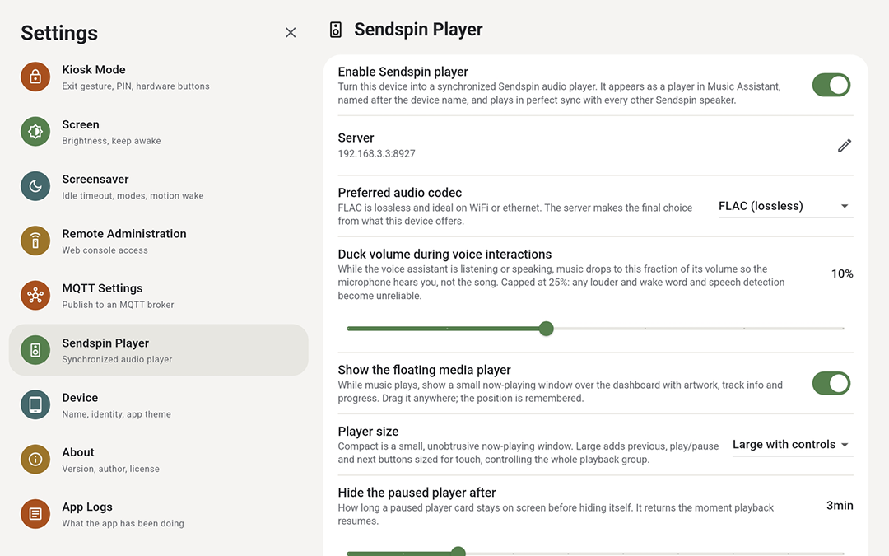
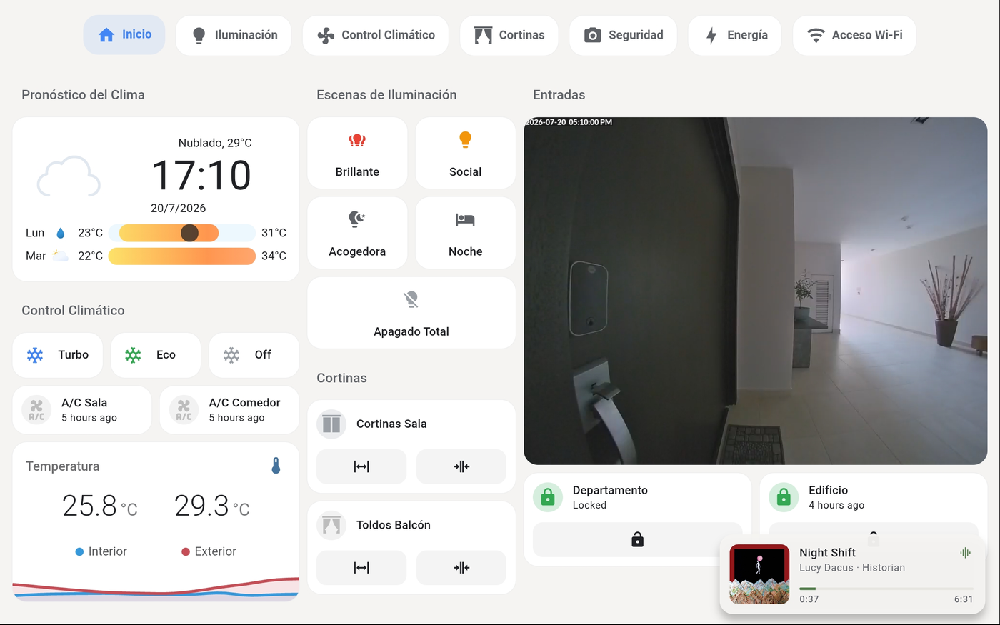
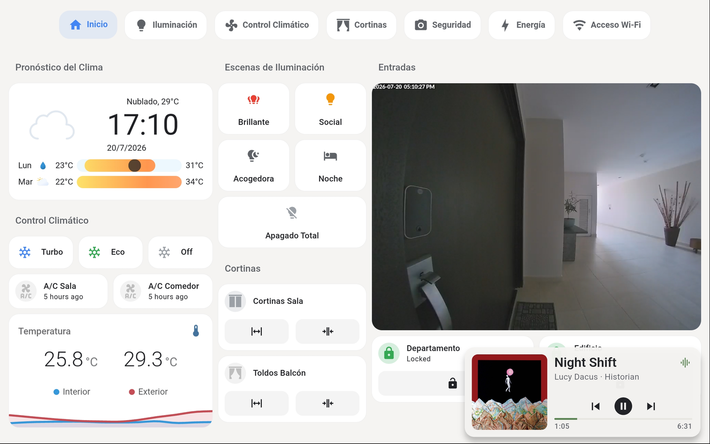
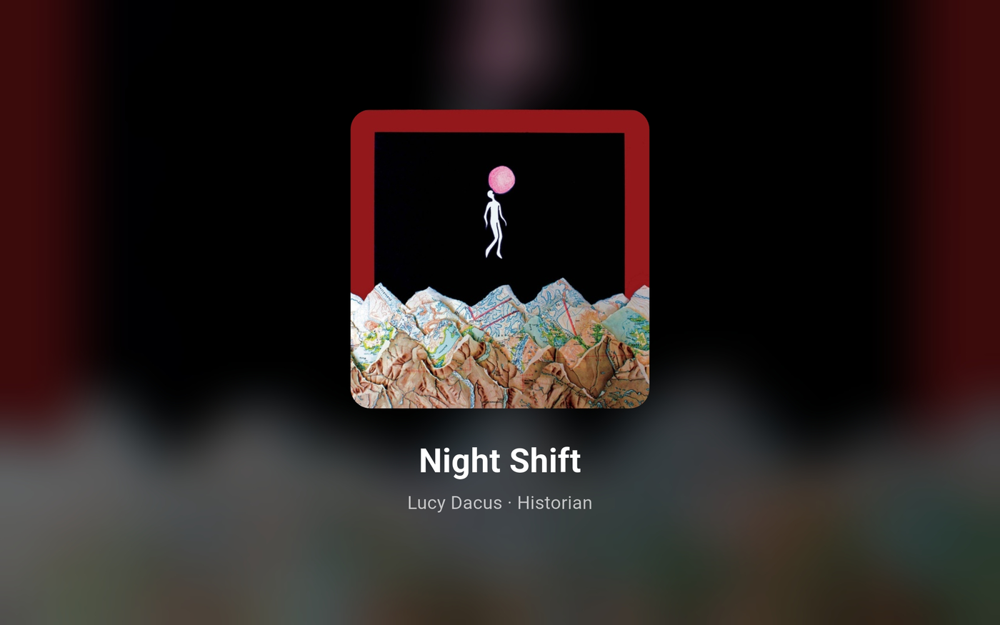

# Kiosk Satellite Sendspin Player

Kiosk Satellite can act as a [Sendspin](https://www.sendspin-audio.com/)
player: the synchronized multi-room audio protocol native to
[Music Assistant](https://www.music-assistant.io/). Enable it and the
tablet appears as a player in Music Assistant automatically, named after
the device name, playing in sample-accurate sync with every other
Sendspin speaker in the house. Through the Music Assistant integration it
also shows up in Home Assistant as a `media_player` entity with full
metadata, artwork and volume control.

Browsing and queueing happen in Music Assistant (or its dashboard card),
voice control through Voice Satellite. On screen, the kiosk provides a
floating now-playing card and an optional full-screen "Now Playing" view
that stands in for the screensaver while music plays.

## Setup

Settings → **Sendspin Player** on the device, or the matching tab in the
remote admin:

| Setting | Default | Notes |
| --- | --- | --- |
| Enable Sendspin player | off | The master switch. |
| Server | | `host:port` of the Sendspin server (Music Assistant listens on port 8927). Leave empty to discover the server via mDNS; note that mDNS does not cross subnets, so set the address explicitly when the tablet and the server live on different networks. |
| Preferred audio codec | FLAC | FLAC (lossless), Opus (efficient) or PCM (uncompressed). The server makes the final choice from what the device offers. |
| Duck volume during voice interactions | 10% | While the voice assistant listens or speaks, music drops to this fraction of its volume. Capped at 25% so wake word and speech detection stay reliable. |
| Show the floating media player | on | The now-playing card described below. |
| Player size | Compact | Compact is display-only; Large adds previous, play/pause and next buttons sized for touch. |
| Hide the paused player after | 3 min | How long a paused card stays before hiding itself. |
| "Now Playing" instead of the screensaver | off | The full-screen view described below. |
| Dismiss "Now Playing" on motion | off | Off, only touch dismisses it, so someone walking past does not interrupt the music display. |

Music Assistant's Sendspin provider is built in and always enabled, and
players register themselves on connection: there is nothing to add on the
server side.

## The floating media player

While music plays, a small now-playing card floats over the dashboard:
artwork, title and artist (long lines marquee), and a live progress bar.
Drag it anywhere; the position is remembered. It follows the app's
light/dark theme.

The Large size adds previous, play/pause and next buttons sized for
touch. They act on the whole playback group through the Sendspin
controller role, so skipping a track here skips it on every speaker in
the group.

Card behavior:

- **Paused** music keeps the card on screen with a play button, ready to
  resume, then hides it after the configured timeout.
- **A quick fling dismisses the card.** Flinging away active playback
  also stops the music. A slow drag repositions instead; the two are
  distinguished by release speed.
- The card hides during voice interactions (Voice Satellite owns the
  screen for the duration) and returns after.
- Track changes hold the previous card through the stream rebuild, so
  nothing flickers between songs.

## "Now Playing" full screen

With the setting enabled, the idle screensaver becomes a full-screen
now-playing view while music plays: the album art stretched and blurred
across the whole screen as a backdrop, the art again as a sharp centered
panel, and large title and artist text. Songs cross-fade into each other.

It behaves like a screensaver, deliberately without controls: touch
dismisses it, motion only if allowed by its setting. With nothing
playing, the regular screensaver appears as usual, and a pause swaps the
view back to the regular screensaver live.

## Voice Satellite interplay

Music and the voice assistant share one speaker and one microphone, so
the player cooperates:

- Playback ducks to the configured fraction during every voice
  interaction (wake word turns, announcements, questions, timers) and
  restores instantly after. The duck is applied in the audio pipeline
  itself, so sync timing and the volume setting are untouched.
- The stop word stays armed during interruptible states, timers
  included: saying "stop" silences the alert or the music.
- While audio plays, the kiosk holds off its screensaver and dashboard
  view rotation the same way it does for any other media interaction
  (unless the "Now Playing" screensaver mode is on, where the
  screensaver is the music display).

## How it works

The player implements `player@v1`, `metadata@v1` and `controller@v1` of
the Sendspin protocol: a WebSocket carries JSON control messages and
timestamped binary audio chunks, a burst-based NTP-style time exchange
feeds a Kalman clock filter, and chunks are scheduled against the DAC's
own timestamps with sample-level insert/drop drift correction. Decoding
uses Android's MediaCodec (no bundled codec libraries). Volume commands
map to the device's media volume, and hardware volume changes are
reported back to the server.

The implementation is adapted from
[SendspinDroid](https://github.com/chrisuthe/SendspinDroid) (MIT), whose
license and attribution ship in the source tree.

## Troubleshooting

- **Player never appears in Music Assistant**: check the app log
  (Settings → App Logs) for `sendspin` lines; `connected as
  kiosksatellite_<id>` means the handshake worked. If discovery finds
  nothing, set the server address explicitly (mDNS does not cross
  subnets or VLANs).
- **Audio is out of sync with other speakers**: give it a few seconds
  after connecting; the clock filter needs a moment to converge. A fixed
  per-device offset can be tuned from Music Assistant's player settings
  (sync adjustment), which the player applies as a static delay.
- **Dropouts on weak WiFi**: prefer the Opus codec; it needs a fraction
  of FLAC's bandwidth.
- **Metadata lags a track change by a few seconds**: Music Assistant
  sends its now-playing snapshots on its own schedule, after the audio
  boundary. The card keeps the previous song on screen and cross-fades
  when the update arrives.
