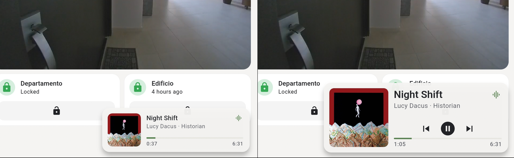
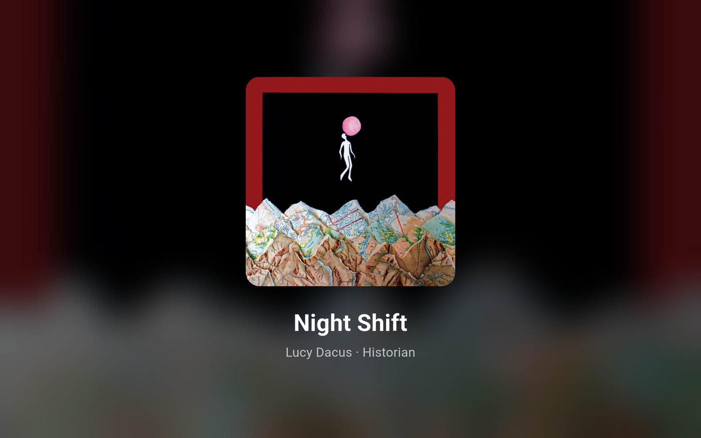

# Kiosk Satellite Media Player

Kiosk Satellite shows and controls music on screen: a floating now-playing
card over the dashboard and an optional full-screen "Now Playing" view that
stands in for the screensaver while music plays, with artwork, transport
controls, lyrics and the queue. The music can be the device's own or
another player's.

The device's own player is [Sendspin](https://www.sendspin-audio.com/),
the synchronized multi-room audio protocol native to
[Music Assistant](https://www.music-assistant.io/). Enable it and the
device appears as a player in Music Assistant automatically, named after
the device name, playing in sample-accurate sync with every other Sendspin
speaker in the house. Through the Music Assistant integration it also
shows up in Home Assistant as a `media_player` entity with full metadata,
artwork and volume control.

Or the surfaces follow a player elsewhere: any Music Assistant player, any
Home Assistant media player or a Sonos speaker directly, for the wall
device whose job is to show and steer the kitchen speakers without making
any music itself.

Browsing and queueing happen in Music Assistant (or its dashboard card),
voice control through Voice Satellite.

## Setup

Settings → **Media Player** on the device or the matching tab in the
remote admin. The page opens on the player pick, then one entry per page:
Sendspin Player, Music Assistant, Sonos, Floating Player and Now Playing.

One rule holds for every source and the page says so at the top: the
floating player and Now Playing show only while the picked player has a
track playing or a queue loaded. With nothing playing or queued, neither
appears.

### Player

| Setting | Default | Notes |
| --- | --- | --- |
| Player source | This device | What the floating player and Now Playing show and control: this device's own Sendspin player or a player in Home Assistant, Music Assistant or a Sonos household. Anything but this device takes the local player offline. |
| Player | Sendspin Player | With this device as the source, its own Sendspin player and nothing to pick. For any other source, that source's players, described under Following another player. |

### Sendspin Player

The device as a synchronized Music Assistant player. The page leaves the
settings while another player is followed, since the local player never
runs in that mode.

| Setting | Default | Notes |
| --- | --- | --- |
| Enable Sendspin player | off | The master switch. |
| Server | | `host:port` of the Sendspin server (Music Assistant listens on port 8927). Leave empty to discover the server via mDNS; note that mDNS does not cross subnets, so set the address explicitly when the device and the server live on different networks. |
| Preferred audio codec | FLAC | FLAC (lossless), Opus (efficient) or PCM (uncompressed). The server makes the final choice from what the device offers. |
| Audio sync offset | 0 ms | Negative plays this device earlier, for speakers that lag behind the group (Bluetooth). Applies live. |
| Duck volume during voice interactions | 10% | While the voice assistant listens or speaks, music drops to this fraction of its volume. Capped at 25% so wake word and speech detection stay reliable. |

Music Assistant's Sendspin provider is built in and always enabled, and
players register themselves on connection: there is nothing to add on the
server side.

### Music Assistant

The Sendspin protocol carries the audio and the track's name, artist and
album, and nothing beyond that. Anything richer comes from Music Assistant's
own API, which is a separate address with its own token: lyrics, the queue,
the list of its players for the picker and the kiosk menu shortcut.

| Setting | Default | Notes |
| --- | --- | --- |
| Server address | | The Music Assistant server's address as its web interface shows it, usually https on port 8095. A self-signed certificate is accepted. |
| Auth token | | A long-lived token from Music Assistant, under Settings then Users. Read access is enough for lyrics; the shortcut below browses as whoever the token belongs to. |
| Validate connection | | Opens the API and authenticates, so a wrong port and a wrong token report differently. |
| Show in the kiosk menu | on | The shortcut described below. |
| Close after inactivity | 0s | Seconds without a touch on the Music Assistant page before it closes itself and the dashboard returns. Zero leaves it open until someone closes it. |
| Hide the close button | off | Remove the floating close button from the Music Assistant page, for the corner it shares with the page's own controls. The back button and the inactivity timer still close it. |

### Sonos

The speakers the kiosk follows directly, described under Following another
player.

| Setting | Default | Notes |
| --- | --- | --- |
| Enable lyrics | on | Lyrics for the followed Sonos room, from Music Assistant. Needs the Music Assistant server address and token; without them the switch is disabled and says so. |
| Adjust the group volume | on | While the followed room plays in a group, the Now Playing volume slider sets the whole group's volume, the way the Sonos app's group slider does. Off, only that room's. |
| Speakers | | Every room the kiosk knows, each with a Forget. **Search** finds Sonos speakers on the device's own network, which must be on the same VLAN as the device to be auto discovered. **Add by address** asks for a speaker's IP for one the search cannot reach and adds the whole household from it. |

### Floating Player

| Setting | Default | Notes |
| --- | --- | --- |
| Show the floating player | on | The now-playing card described below. |
| Player size | Compact | Compact is display-only; Large adds previous, play/pause and next buttons sized for touch. |
| Hide the paused player after | 3 min | How long a paused player stays on screen, the floating card and the Now Playing view alike. |
| Keep playing when dismissed | off | Flinging the card away hides it without stopping the music. |
| Show in the kiosk menu | off | A Show or Hide Floating Player entry in the kiosk menu. With nothing playing and no queue for this player, the entry stays out. |

### Now Playing

| Setting | Default | Notes |
| --- | --- | --- |
| "Now Playing" instead of the screensaver | off | The full-screen view described below. |
| Show media controls | on | Previous, play/pause and next buttons and a progress bar on the view. With controls on, a close button dismisses the view instead of a tap anywhere and a pause keeps the view up for the paused player timeout. |
| Double tap to dismiss | off | A double tap anywhere on the view dismisses it and the close button is not shown. Taps on the buttons and the queue rows never count. |
| Launch Now Playing when music starts playing | on | Open the view as soon as playback starts instead of waiting for the screensaver timeout. |
| Dismiss "Now Playing" on motion | off | Off, only touch dismisses it, so someone walking past does not interrupt the music display. |
| Show in the kiosk menu | off | Add a Now Playing entry to the kiosk menu that brings the view up. A paused track opens paused, with its play button. With nothing playing and no queue for this player, the entry stays out. |
| Lyrics timing | +0.3s | Shifts the lyrics against the music. Positive shows each line earlier. Shown while the view's lyrics toggle is on. |

## Following another player

By default the floating card and the "Now Playing" screen belong to this
device's own player: what plays here is what they show. **Player source**
points them at a player elsewhere instead, for the wall-mounted device whose job
is to show and steer the music without making any of it and the
**Player** dropdown under it lists that source's players:

- **This device**, the Sendspin player above.
- **Music Assistant** players, the server's own list, when its address and
  token are set. Offline players are marked.
- **Home Assistant** media players, every `media_player` entity by name
  with the entity id beneath, over the Home Assistant connection the kiosk
  already has. This device's own entities stay out of the list, and so do
  Music Assistant's, which only know what Music Assistant plays and which
  the Music Assistant source lists as its own players.
- **Sonos** rooms, read from the speakers themselves over their local
  interface, with no Home Assistant or Music Assistant in between. The
  list names every room of the household the way the Sonos app does,
  rooms playing together as one entry. The speakers come from the Sonos
  page: found by its search on the device's own network or added there by
  address for a speaker on another VLAN, which the search never reaches.

Pick a player and the card, the full-screen view and the transport buttons
all follow it: its track, its artwork, its progress, its play and pause,
shuffle and seek where the player allows them. The full-screen view wears
a chip with the player's name so the room knows whose music it is. Lyrics
follow a followed player too, timed from the position its own system
reports.

What each source offers differs a little:

| | Track, art, transport | Lyrics | Queue panel |
| --- | --- | --- | --- |
| This device | yes | yes | yes |
| Music Assistant player | yes | yes | yes |
| Home Assistant media player | yes | yes | no |
| Sonos, direct | yes | with Music Assistant | yes |

Every Home Assistant media player is treated the same, whatever integration
stands behind it. Buttons a player cannot honor stay out of the view: a
player that reports no seeking has no thumb on its progress bar, one
without previous and next has no skip buttons.

A Sonos that Home Assistant also knows appears under both groups. Picked
under Home Assistant it is a generic player like any other. Picked under
Sonos, the kiosk talks to the speaker directly: the track, artwork and
position are read from the speaker once a second while it plays, so the
lyrics stay in step, the queue panel lists the speaker's own queue with a
tap to jump, shuffle sets the speaker's play mode and the volume is the
room's or the group's while the room plays in one. The follower tracks
the group the room belongs to, so regrouping from the Sonos app re-points
it on its own. A radio stream has no pause on a Sonos, so the pause button
stops it, the way the speaker itself does and the queue panel shows
nothing queued while a station or a line-in plays outside the queue.
Artwork for Spotify and Deezer tracks comes from the service's public
image lookup: the speaker only proxies those images through itself and
hangs when it cannot reach the service, which a speaker on a walled-off
VLAN often cannot.

With another player picked the device is a remote control, not a player:
its own Sendspin player shuts down and shows as offline in Music
Assistant, so nobody queues music to a screen that was never meant to make
any. The settings follow suit: the Sendspin Player page leaves the settings
for the duration, while the Floating Player and Now Playing pages stay,
since they are what the mode is for. Pick **This device** and the player
comes back online with its page.

One behavior carries over unchanged: flinging the card away stops the
followed player's music, exactly as it does locally, unless "Keep playing
when dismissed" says otherwise.

## The Music Assistant shortcut

With a server address set, a **Music Assistant** entry appears in the kiosk
menu and opens the server's own web interface over the dashboard: the full
library, search, queue, playlists and radio, exactly as they are on a phone
or a laptop. Close it (or press back) and the dashboard is still there,
loaded, with the voice session and the wake word untouched, because the page
never left.

The interface is Music Assistant's, not a copy of it, so browsing and
queueing stay whatever the server's current version makes them. Playback
itself needs nothing more than the Sendspin player above: queue to this
device and it plays here. The page opens with the right player already
selected: this device's own or the followed Music Assistant player when
**Player** points at one.

**Close after inactivity** puts the dashboard back on its own, for the wall
device whose visitor queued a song and walked away: up to a minute without a
touch anywhere on the Music Assistant page and it closes itself. Scrolling
and tapping count, so reading a long album page keeps it up. At zero it
stays until someone closes it, which is what a desk or a kitchen counter
wants. Everything else that closes it works the same as ever: the close
button, the back button, and a wake word.

**Hide the close button** is for the corner the button shares with Music
Assistant's own controls: the full-screen "now playing" view puts its
three-dot menu exactly there, unreachable under the button. With the
button hidden, the back button, a wake word and the inactivity timer
still lead back to the dashboard.

**No second sign-in.** Music Assistant keeps its own session, so the shortcut
would land on its login screen every time storage is cleared. Instead the
token above is handed to the page as it loads, and the interface opens
already signed in, as the user that token belongs to. Give the token the
rights that user should have on the device: a read-only token browses but
cannot queue. Signing in by hand still works and is left alone when it
happens, and the token is only ever given to pages on the configured server.

Home Assistant's own login cannot stand in for it, even though the dashboard
is signed in: Home Assistant mints a separate token per application and asks
for the password each time one is granted.

The server address alone is enough to show the entry; without a token the
shortcut opens Music Assistant's login screen. Music Assistant's own
certificate is accepted the same way the dashboard's is, through **Ignore SSL
errors** in the Browser settings. In kiosk mode the entry follows **Allowed
Actions**, where it can be left out of the restricted quick-actions menu.

## The floating player

While music plays, a small now-playing card floats over the dashboard:
artwork, title and artist (long lines marquee), and a live progress bar.
Drag it anywhere; the position is remembered. It follows the app's
light/dark theme.

The Large size adds previous, play/pause and next buttons sized for
touch. They act on the whole playback group through the Sendspin
controller role, so skipping a track here skips it on every speaker in
the group or on the followed player when there is one.

Card behavior:

- **Paused** music keeps the card on screen with a play button, ready to
  resume, then hides it after the configured timeout.
- **A quick fling dismisses the card.** Flinging away active playback
  also stops the music. A slow drag repositions instead; the two are
  distinguished by release speed.
- The card hides during voice interactions (Voice Satellite owns the
  screen for the duration) and returns after.
- Track changes hold the previous card through the stream rebuild, so
  nothing flickers between songs.

The kiosk menu's **Show Floating Player** entry summons the card on demand
and **Hide Floating Player** puts it away without stopping the music. In
kiosk mode both follow the **Floating Player** row under Allowed Actions.

## "Now Playing" full screen

With the setting enabled, the idle screensaver becomes a full-screen
now-playing view while music plays: the album art stretched and blurred
across the whole screen as a backdrop, the art again as a sharp centered
panel, and large title and artist text. Songs cross-fade into each other.

It starts like a screensaver, at the idle timeout, or the moment music
starts with **Launch Now Playing when music starts playing** on: the wall
shows the song someone just queued from their phone without waiting for
the room to go idle. Motion dismisses it only if allowed by its setting.
With nothing playing, the regular screensaver appears as usual, and a
pause swaps the view back to the regular screensaver live.

### Media controls

**Show media controls**, on by default, puts the floating card's transport
under the cover: previous, play/pause and next sized for touch, acting on
the whole playback group exactly as the Large card's buttons do, and a
progress bar with the elapsed and total time. Where the player allows
seeking the bar carries a thumb and dragging it jumps the track; elsewhere
it is the card's progress line at full size. Music Assistant sends no
fresh progress report after a seek or a queue jump, so the player carries
a seek's target itself and otherwise reads the server's own queue time
every few seconds, re-basing the moment the two drift apart, which keeps
the bar, the floating card and the lyrics on the audio. The buttons and
the bar stay put between songs while the cover and the title cross-fade
behind them.

Smaller toggles flank the transport the way Music Assistant's own player
lays them out, two slots a side, a blank standing in for any the source
lacks so the transport never leaves center. On the left, **volume** and
**shuffle**, lit while the queue is shuffled and following a shuffle set
from Music Assistant itself within a moment. On the right, **lyrics** and **queue**, each lit while it
is the panel. The volume toggle swaps the progress bar for a volume slider
with the level beside it, back to the progress bar four seconds after the
last touch or on a second tap: the device's media volume for this device's
own player, the followed player's own volume otherwise and for a Sonos
the room's or the group's while the room plays in one. The speaker
beside the slider mutes: the player's own mute where it has one and
for this device's own player its media volume held at zero until the
unmute puts the level back. The choice sticks across
sessions and the two keep each other exclusive: lyrics and the queue
share one slot, beside the cover on a landscape screen and under it on a
portrait one. The queue is laid out the way Music Assistant's own is: what
already played, faded, above a Now Playing heading, the playing track
under it, then an Up next heading with the count of what follows and the
rest. It opens on the Now Playing heading and goes back there at each
track change, follows the queue as Music Assistant changes it (a queue
cleared there takes the last track off the card and the view) and a tap
on any row jumps the queue there, the row spinning until the player is
actually playing it. The queue needs a source with a queue behind it: a
followed Home Assistant player has none and its toggle stays out, with a
blank keeping the transport centered.

The transport keeps its place along the bottom of the screen whatever
the layout does: the lyrics or the queue appearing rearranges the cover
above it, never the buttons under a finger.

Pausing from the view keeps it up, paused, with its play button, for as
long as **Hide the paused player after** keeps the floating card: the
person who pressed pause on that screen is not done with it. Once the
view is dismissed, the time runs out or the track goes away, the regular
screensaver takes the slot back, and a pause made while the view is not
on screen never holds it. With the controls off a pause swaps the view
back to the regular screensaver at once, as before.

With controls on screen a tap can no longer mean "dismiss", so the view
carries a close button in the top right corner, the same floating close
the Music Assistant page wears, and touches anywhere else do nothing but
press what they land on. **Double tap to dismiss** trades the button for
a double tap anywhere on the view, for the screen everyone is used to
tapping: a tap on the transport, the toggles or a queue row never counts,
so a quick double press on Next skips twice. The back button dismisses it
as it does any screensaver and the motion setting is unchanged. With the
controls off the view is the control-free display it always was: a tap
anywhere dismisses it.

Lyrics and the At a Glance row keep their layouts, with the transport
under the cover in each: beside the lyrics on a landscape screen, above
them on a portrait one, and above the row on the plain view, where the
cover gives back a little size so everything fits a short screen.

### Lyrics

With the view's lyrics toggle on, the view splits: the cover and track to
one side, the song's lyrics to the other, the current line lit and the
rest receding as it scrolls itself in time with the music. For this
device's own player the line follows Sendspin's own synced position, the
same one that keeps the audio aligned. For a followed player it follows
the position that player's system reports: Music Assistant's queue time,
read every few seconds or the Home Assistant entity's last position plus
the time since, refreshed at every transport event.

Lyrics come from Music Assistant when it is set up, so **Music Assistant
needs a lyrics provider of its own** for that: add one under its
Settings, then Providers; LRCLIB is free and needs no account. Tracks
Music Assistant cannot match and every track when no Music Assistant
server is configured, are looked up on LRCLIB directly by title, artist
and length.

**Lyrics timing** nudges the lines against the music, and defaults to
showing them 0.3 seconds early: an LRC timestamp marks where a line starts
being sung, so displaying it at exactly that moment leaves no time to read it
first. Sync quality also varies from track to track, so raise it if the lines
consistently arrive too late for comfort, or go negative if they run ahead.
Files that carry the format's own `[offset:]` correction are honoured on top
of this.

The layout follows the panel: side by side on a landscape screen, and on a
portrait one the cover and track sit at the top with the lyrics filling the
space below them. A panel too small for either keeps the ordinary centred
view rather than squeezing a couple of lines into a corner.

Only timed lyrics are shown. A track whose provider returns plain, untimed
words shows none, since there is no honest way to follow along with them, and
tracks with no lyrics at all simply keep the ordinary layout. Lyrics are
looked up once per track.

## Voice Satellite interplay

Music and the voice assistant share one speaker and one microphone, so
the player cooperates:

- Playback ducks to the configured fraction during every voice
  interaction (wake word turns, announcements, questions, timers) and
  restores instantly after. The duck is applied in the audio pipeline
  itself, so sync timing and the volume setting are untouched.
- The stop word stays armed during interruptible states, timers
  included: saying "stop" silences the alert or the music.
- While audio plays, the kiosk holds off its screensaver the same way
  it does for any other media interaction (unless the "Now Playing"
  screensaver mode is on, where the screensaver is the music display).
  Dashboard view rotation and the return to home timer keep running:
  music plays behind whatever view is up. Use Hold mode to pin a view
  for the duration of playback.

## How it works

The player implements `player@v1`, `metadata@v1` and `controller@v1` of
the Sendspin protocol: a WebSocket carries JSON control messages and
timestamped binary audio chunks, a burst-based NTP-style time exchange
feeds a Kalman clock filter, and chunks are scheduled against the DAC's
own timestamps with sample-level insert/drop drift correction. Decoding
uses Android's MediaCodec (no bundled codec libraries). Volume commands
map to the device's media volume, and hardware volume changes are
reported back to the server.

A followed Music Assistant player is read over Music Assistant's own API
on one long-lived socket: the active queue on connect, then the queue and
player events the server pushes. A followed Home Assistant player is one
`subscribe_entities` subscription on the Home Assistant websocket, with
the transport sent back as `media_player` service calls on the same
socket. A followed Sonos is polled over the speaker's UPnP services on
port 1400: the transport state and position from the group's coordinator
once a second while playing and every few seconds otherwise, the play
mode and the volume a little less often, the household topology every
half minute and the queue through the speaker's ContentDirectory. Polling
rather than events keeps it working across VLANs, where a speaker could
never reach an event callback on the device.

The implementation is adapted from
[SendspinDroid](https://github.com/chrisuthe/SendspinDroid) (MIT), whose
license and attribution ship in the source tree.

## Troubleshooting

- **Player never appears in Music Assistant**: check the app log
  (Settings → Logs) for `sendspin` lines; `connected as
  kiosksatellite_<id>` means the handshake worked. If discovery finds
  nothing, set the server address explicitly (mDNS does not cross
  subnets or VLANs).
- **Audio is out of sync with other speakers**: give it a few seconds
  after connecting; the clock filter needs a moment to converge. A fixed
  per-device offset can be tuned from Music Assistant's player settings
  (sync adjustment), which the player applies as a static delay.
- **Dropouts on weak WiFi**: prefer the Opus codec; it needs a fraction
  of FLAC's bandwidth.
- **Metadata lags a track change by a few seconds**: Music Assistant
  sends its now-playing snapshots on its own schedule, after the audio
  boundary. The card keeps the previous song on screen and cross-fades
  when the update arrives.
- **No Sonos found**: the Sonos page's search is a multicast on the
  device's own network, which a speaker on another VLAN never hears. Add
  it by address on that page instead; the kiosk needs to reach the
  speaker on port 1400, which a router between the two usually allows.
- **A followed Home Assistant player shows no track**: the entity has to
  report a `media_title`. Players that only stream line-in or a TV input
  carry none and the card stays empty until something with metadata
  plays.
